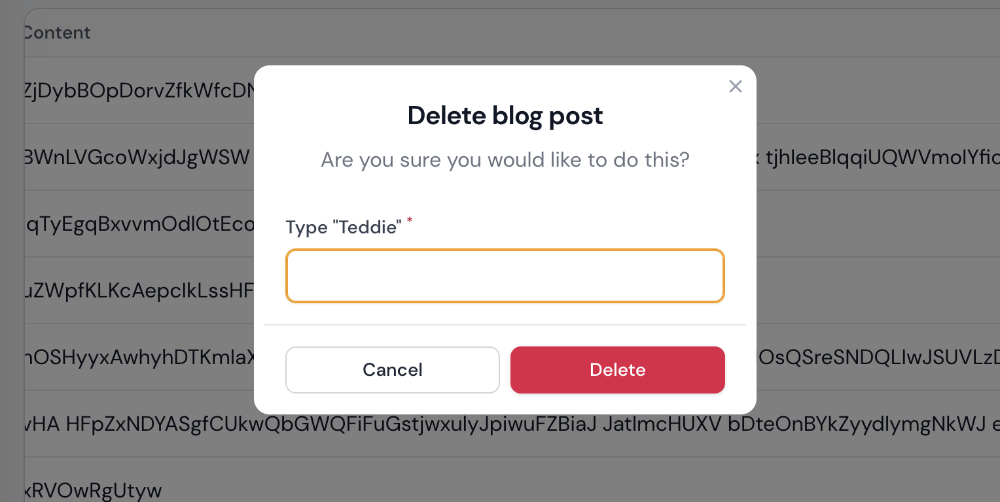

# Filament Confirm Delete

<a href="https://filamentadmin.com/docs/2.x/admin/installation">
    
</a>
<a href="https://packagist.org/packages/konnco/filament-safely-delete">
    
</a>
<a href="https://packagist.org/packages/konnco/filament-safely-delete">
    
</a>

[](https://github.com/konnco/filament-safely-delete/actions/workflows/php-cs-fixer.yml)
[](https://github.com/konnco/filament-safely-delete/actions/workflows/run-tests.yml)

This plugin is intended for those of you who are worried about your data being accidentally deleted.

## Installation

You can install the package via composer:

```bash
composer require konnco/filament-safely-delete
```

## Usage

import the actions into the `Resource` page

```php
use Konnco\FilamentSafelyDelete\Tables\Actions\DeleteAction;

class PostResource extends Resource
{
    public static function table(Table $table): Table
    {
        return $table
            ->columns([
                Tables\Columns\TextColumn::make('title'),
                Tables\Columns\TextColumn::make('slug'),
                Tables\Columns\TextColumn::make('body'),
            ])
            ->filters([
                //
            ])
            ->actions([
                Tables\Actions\EditAction::make(),
                DeleteAction::make()
                    ->usingField('title')
            ])
            ->bulkActions([
                Tables\Actions\DeleteBulkAction::make(),
            ]);
    }
}

## Testing

```bash
composer test
```

## Changelog

Please see [CHANGELOG](CHANGELOG.md) for more information on what has changed recently.

## Contributing

Please see [CONTRIBUTING](https://github.com/konnco/.github/blob/main/CONTRIBUTING.md) for details.

## Security Vulnerabilities

Please review [our security policy](../../security/policy) on how to report security vulnerabilities.

## Contributors

<!-- readme: contributors -start -->
<table>
<tr>
    <td align="center">
        <a href="https://github.com/frankyso">
            
            <br />
            <sub><b>Franky So</b></sub>
        </a>
    </td>
    <td align="center">
        <a href="https://github.com/ijalnasution">
            
            <br />
            <sub><b>Abangijal</b></sub>
        </a>
    </td></tr>
</table>
<!-- readme: contributors -end -->
